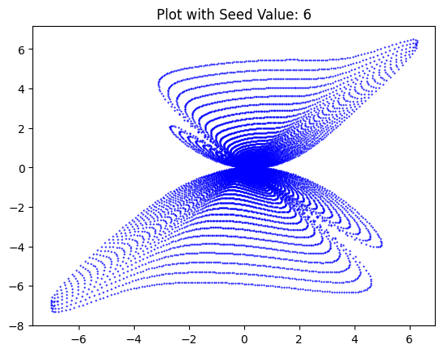
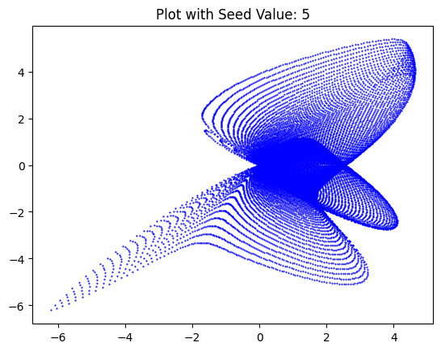
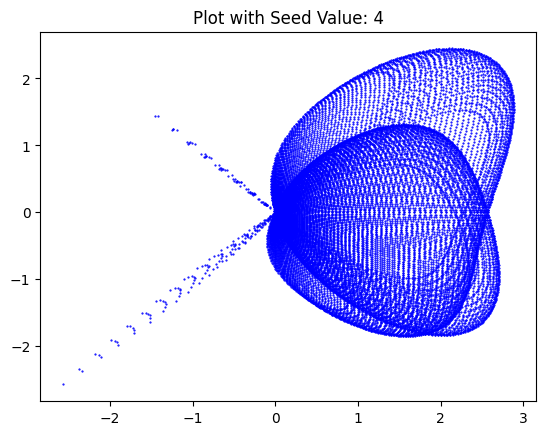

# Circled square and random code art generation
takes a square grid of points and applies various transformations from https://arxiv.org/pdf/1509.06344.pdf to circle it. further applies a transformation to one of these circles with randomised parameters to output cool graphs, like:

